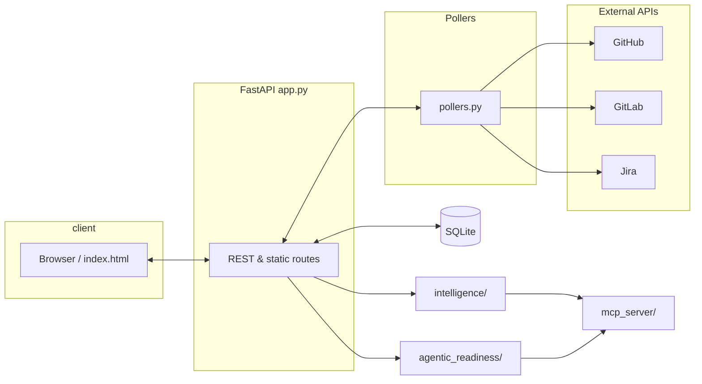

# Workstream

Your developer command center — PRs, tasks, calendar, and AI in one dashboard.

Workstream is a developer productivity dashboard that runs locally as a Python [FastAPI](https://fastapi.tiangolo.com/) app. It aggregates GitHub PRs, GitLab MRs, Jira tasks, Google Calendar, weather, AI code review, intelligence collection (historical PR review analysis), and AI readiness scanning into a single-page dashboard with dark and light mode.

## Feature highlights

| Area | What you get |
|------|----------------|
| **PR dashboard (GitHub + GitLab)** | Open PRs, assigned work, reviews, CI status, staleness indicators |
| **Jira** | Sprint tracking, task counts, yearly completion stats |
| **Google Calendar** | Today and tomorrow agenda with meeting join links |
| **AI code review** | Review PRs with Claude, Gemini, Ollama, or copy-prompt for any LLM |
| **Review intelligence** | Analyze historical PR reviews to learn team patterns |
| **AI readiness scanner** | Score GitHub repos for AI/agentic development readiness, generate bootstrapping files, create draft PRs |
| **Desktop notifications** | PR approved, CI failed, meeting starting |
| **Focus banner** | Real-time summary of what needs attention |
| **Widgets & habits** | Weather, live clock, stretch reminders, quick notes |
| **UX** | Keyboard shortcuts, search/filter, dark/light mode |
| **MCP server** | Expose dashboard data and tools to AI assistants |

## Quick start

1. **Prerequisites:** Python 3.11 or newer, and a [GitHub personal access token](https://docs.github.com/en/authentication/keeping-your-account-and-data-secure/creating-a-personal-access-token) for the PR dashboard.
2. **Clone** this repository.
3. **Configure:** Copy `.env.example` to `.env` and fill in credentials for the integrations you use.
4. **Run:** Execute `./run.sh` for a manual start, or `./install.sh` on macOS to install a LaunchAgent for auto-start.
5. **Open** [http://localhost:8080](http://localhost:8080) in your browser.

## Configuration

Key environment variables (see [docs/CONFIGURATION.md](docs/CONFIGURATION.md) for the full guide):

| Variable | Purpose |
|----------|---------|
| `GITHUB_PAT` | GitHub API token (required for core PR features) |
| `GITHUB_USERNAME` | Your GitHub login (required) |
| `GITLAB_PAT`, `GITLAB_URL`, `GITLAB_USERNAME` | Optional GitLab MR integration |
| `JIRA_URL`, `JIRA_EMAIL`, `JIRA_API_TOKEN`, `JIRA_PROJECTS` | Optional Jira integration |
| `GOOGLE_CREDENTIALS_PATH`, `GOOGLE_TOKEN_PATH`, `GOOGLE_CALENDAR_IDS` | Optional Google Calendar |
| `AI_CLAUDE_API_KEY`, `AI_GEMINI_API_KEY`, `AI_OLLAMA_URL` | Optional AI review providers |
| `POLL_INTERVAL`, `DISPLAY_NAME`, `DB_PATH`, `REPOS_YAML` | Optional behavior and paths |

## Architecture



The browser loads the single-page UI from `static/index.html` and talks to **FastAPI** (`app.py`). **Pollers** refresh data from GitHub, GitLab, and Jira. State is stored in **SQLite** (`database.py`). **Intelligence** and **agentic readiness** modules power review analytics and repo scoring; the **MCP server** exposes tools for AI clients.

## Project structure

```
dashboard/
├── app.py                 # FastAPI application & API routes
├── config.py              # Configuration management
├── database.py            # SQLite schema & queries
├── pollers.py             # Background data polling
├── reviewer.py            # AI code review engine
├── static/index.html      # Single-page frontend
├── intelligence/          # Historical PR review analysis
│   ├── collector.py
│   ├── analyzer.py
│   └── db.py
├── agentic_readiness/     # AI readiness scanner
│   ├── scanner.py
│   ├── scorer.py
│   └── generator.py
├── mcp_server/            # MCP server for AI tools
├── bin/workstream          # CLI tool
├── install.sh             # macOS LaunchAgent installer
├── run.sh                 # Manual run script
└── docs/                  # Documentation
```

## CLI reference

After installation, add `bin` to your `PATH` or invoke `./bin/workstream`. Commands assume the macOS LaunchAgent is installed when using `start` / `stop` / `restart`.

| Command | Description |
|---------|-------------|
| `workstream start` | Start the Workstream service (LaunchAgent) |
| `workstream stop` | Stop the service |
| `workstream restart` | Restart the service |
| `workstream status` | Show whether the service is running |
| `workstream open` | Open the dashboard in the default browser |
| `workstream logs` | Tail the application log |
| `workstream collect-reviews` | Collect historical PR reviews from configured release-service repos |
| `workstream collect <url>` | Collect and analyze PR reviews for any GitHub repo |
| `workstream analyze-reviews` | Run pattern analysis on collected review data |
| `workstream review-stats` | Print review intelligence statistics |
| `workstream scan-repo <url>` | Scan a GitHub repo for AI/agentic readiness |
| `workstream mcp-status` | Check MCP server module and database health |
| `workstream help` | Show usage |

## Contributing

Contributions are welcome. See [CONTRIBUTING.md](CONTRIBUTING.md) for guidelines.

## License

Workstream is licensed under the [Apache License 2.0](LICENSE).
