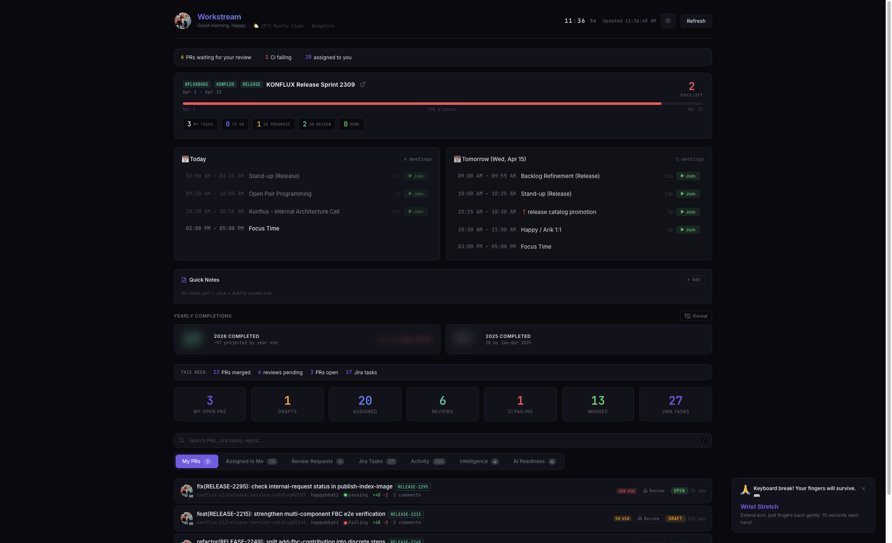
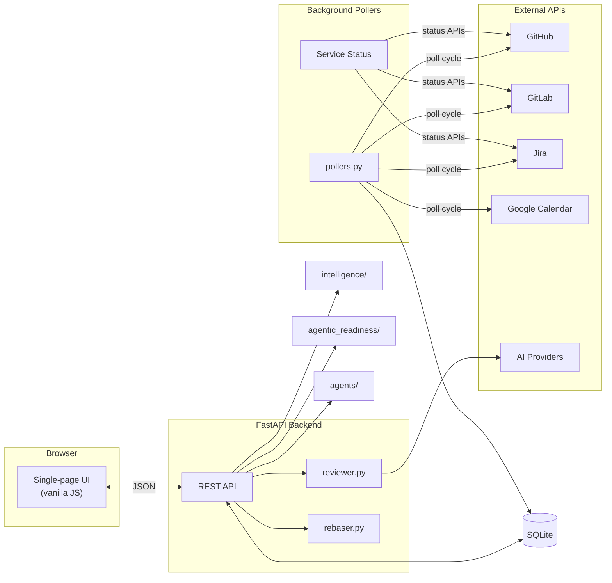
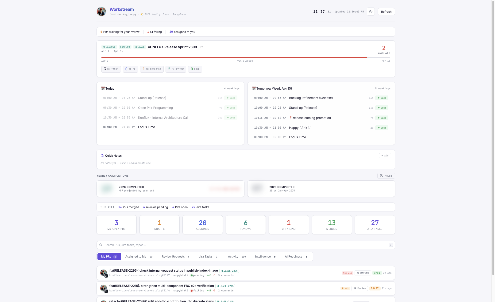
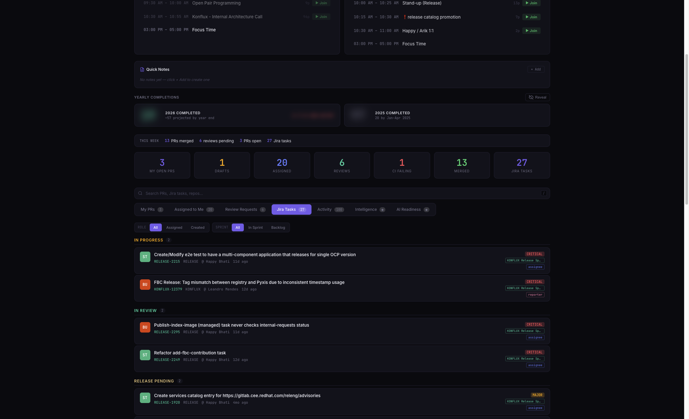
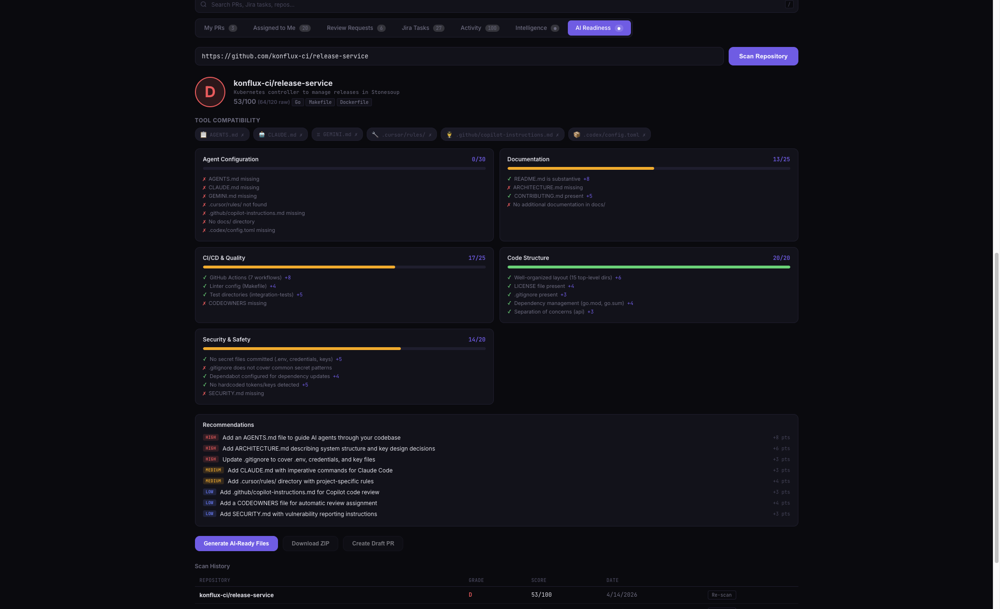
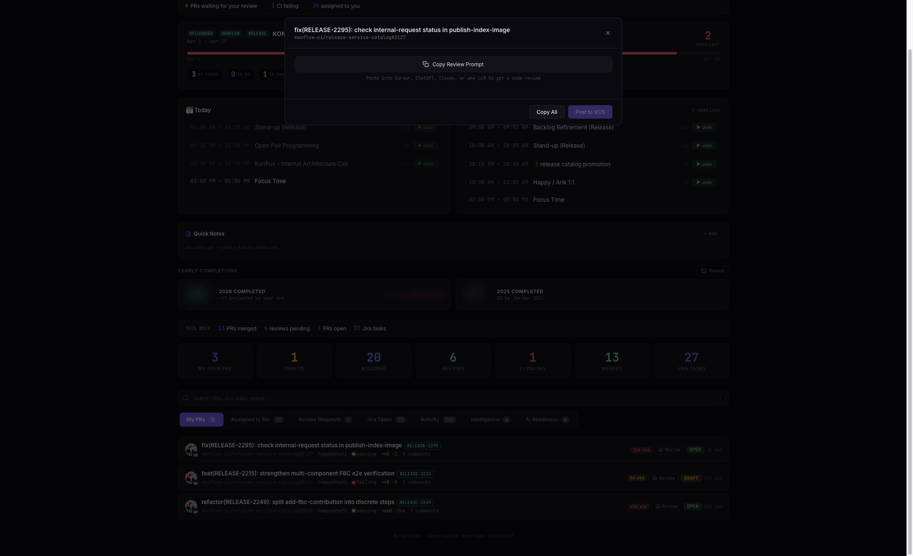
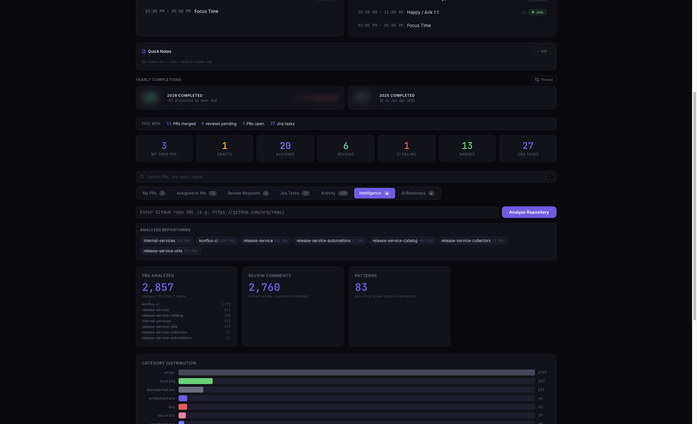
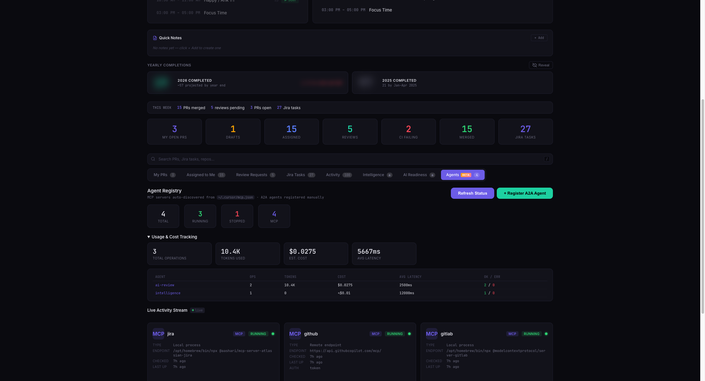

<p align="center">
  <h1 align="center">Workstream</h1>
  <p align="center">
    <strong>One dashboard. Every signal. Zero tab-switching.</strong>
  </p>
  <p align="center">
    PRs &middot; Code Review &middot; Jira &middot; Calendar &middot; AI Readiness &middot; Agents
  </p>
  <p align="center">
    <a href="#quick-start">Quick Start</a> &middot;
    <a href="#features">Features</a> &middot;
    <a href="docs/FEATURES.md">Full Docs</a> &middot;
    <a href="docs/CONFIGURATION.md">Configuration</a> &middot;
    <a href="CONTRIBUTING.md">Contributing</a>
  </p>
</p>

<br/>

<p align="center">
  
</p>

<br/>

## Why Workstream?

Modern developers live across 6+ tabs — GitHub, GitLab, Jira, Calendar, AI tools, status pages. Each context switch costs **23 minutes** of refocus time ([UC Irvine research](https://ics.uci.edu/~gmark/chi08-mark.pdf)).

**Workstream eliminates that.** It's a local-first, single-screen command center that pulls everything into one view — with AI superpowers baked in. No SaaS. No cloud. Your data stays on your machine.

```
pip install -r requirements.txt && cp .env.example .env && ./run.sh
```

---

## Features

<table>
<tr>
<td width="50%">

### Pull Requests
Unified view of PRs across **GitHub** and **GitLab**. CI status, staleness badges, review state, and an amber "changes since your review" indicator — all at a glance.

### One-Click Rebase
Rebase any PR onto its base branch (or a custom target) without merge commits. GitHub uses local git + `--force-with-lease`; GitLab uses the native API. Conflict detection included.

### AI Code Review
Review PRs with **OpenAI**, **Claude**, **Gemini**, or **Ollama** (local). Copy-prompt mode works with any LLM. Human approval required before posting to VCS.

</td>
<td width="50%">

### Jira Integration
Sprint tracking, task counts by role, yearly completion comparison (pro-rated), and deep links to Jira boards and JQL views.

### Google Calendar
Side-by-side today + tomorrow agenda with attendee counts and Google Meet join links.

### Service Health
Live status monitoring for GitHub, Atlassian, and GitLab. Color-coded header dot with expandable incident details.

</td>
</tr>
<tr>
<td width="50%">

### AI Readiness Scanner
Score any repo across **6 categories** on a research-backed **170-point rubric**. Generates bootstrapping files (with optional AI enhancement) and opens draft PRs.

### Review Intelligence
Collects merged PR history from any GitHub repo to surface recurring review patterns, feedback themes, and reviewer profiles.

</td>
<td width="50%">

### Agents Dashboard
Auto-discovers MCP servers from your Cursor config. Tracks A2A agents with health checks, token/cost telemetry, and a live activity stream.

### Developer Ergonomics
Focus banner, keyboard shortcuts, global search, desktop notifications, dark/light mode, weather widget, stretch reminders, and quick notes.

</td>
</tr>
</table>

---

## Quick Start

**Prerequisites:** Python 3.11+, a [GitHub PAT](https://docs.github.com/en/authentication/keeping-your-account-and-data-secure/creating-a-personal-access-token)

```bash
git clone https://github.com/happybhati/workstream.git
cd workstream
python3 -m venv venv && source venv/bin/activate
pip install -r requirements.txt
cp .env.example .env   # add your GitHub PAT and username
./run.sh               # or ./install.sh for macOS auto-start
```

Open **[localhost:8080](http://localhost:8080)** — that's it.

> **Tip:** On macOS, `./install.sh` sets up a LaunchAgent so Workstream starts on login and restarts on crash.

---

## Configuration

Everything is controlled via `.env`. Only `GITHUB_PAT` and `GITHUB_USERNAME` are required — every other integration is opt-in.

| Integration | Variables | Guide |
|-------------|-----------|-------|
| GitHub (required) | `GITHUB_PAT`, `GITHUB_USERNAME` | [Fine-grained token setup](docs/CONFIGURATION.md#github-required) |
| GitLab | `GITLAB_PAT`, `GITLAB_URL`, `GITLAB_USERNAME` | [GitLab guide](docs/CONFIGURATION.md#gitlab-optional) |
| Jira | `JIRA_URL`, `JIRA_EMAIL`, `JIRA_API_TOKEN`, `JIRA_PROJECTS` | [Jira guide](docs/CONFIGURATION.md#jira-optional) |
| Google Calendar | `GOOGLE_CREDENTIALS_PATH` | [OAuth setup](docs/CONFIGURATION.md#google-calendar-optional) |
| AI Review | `AI_OPENAI_API_KEY`, `AI_CLAUDE_API_KEY`, `AI_GEMINI_API_KEY` | [Provider setup](docs/CONFIGURATION.md#ai-code-review-optional) |

See **[docs/CONFIGURATION.md](docs/CONFIGURATION.md)** for the full reference with all variables and defaults.

---

## Architecture



**Stack:** Python 3.11+ &middot; FastAPI &middot; SQLite &middot; Vanilla JS &middot; CSS Variables &middot; No build step

---

## Screenshots

<details>
<summary><strong>Dashboard — light mode</strong></summary>
<br/>

</details>

<details>
<summary><strong>Jira Tasks</strong></summary>
<br/>

</details>

<details>
<summary><strong>AI Readiness Scanner</strong></summary>
<br/>

</details>

<details>
<summary><strong>AI Code Review</strong></summary>
<br/>

</details>

<details>
<summary><strong>Review Intelligence</strong></summary>
<br/>

</details>

<details>
<summary><strong>Agents Dashboard</strong></summary>
<br/>

</details>

---

## CLI

```bash
workstream start          # Start via LaunchAgent
workstream stop           # Stop service
workstream restart        # Restart service
workstream status         # Check if running
workstream open           # Open dashboard in browser
workstream logs           # Tail application log
workstream scan-repo URL  # Scan a repo for AI readiness
workstream collect URL    # Collect PR review history
workstream help           # Show all commands
```

---

## Project Structure

```
workstream/
├── app.py                    # FastAPI routes
├── config.py                 # Settings from .env
├── database.py               # SQLite schema & queries
├── pollers.py                # Background polling + service status
├── reviewer.py               # AI review engine (OpenAI, Claude, Gemini, Ollama)
├── rebaser.py                # PR rebase engine (GitHub git + GitLab API)
├── static/index.html         # Single-page frontend (zero dependencies)
├── agentic_readiness/        # AI readiness scanner, scorer, generator
├── intelligence/             # PR review pattern analysis
├── agents/                   # MCP/A2A agent observability
├── mcp_server/               # MCP server for AI tool integration
├── bin/workstream            # CLI
├── tests/                    # pytest suite
└── docs/                     # Documentation
```

---

## Contributing

Contributions are welcome. See **[CONTRIBUTING.md](CONTRIBUTING.md)** for guidelines.

## License

[Apache License 2.0](LICENSE)
